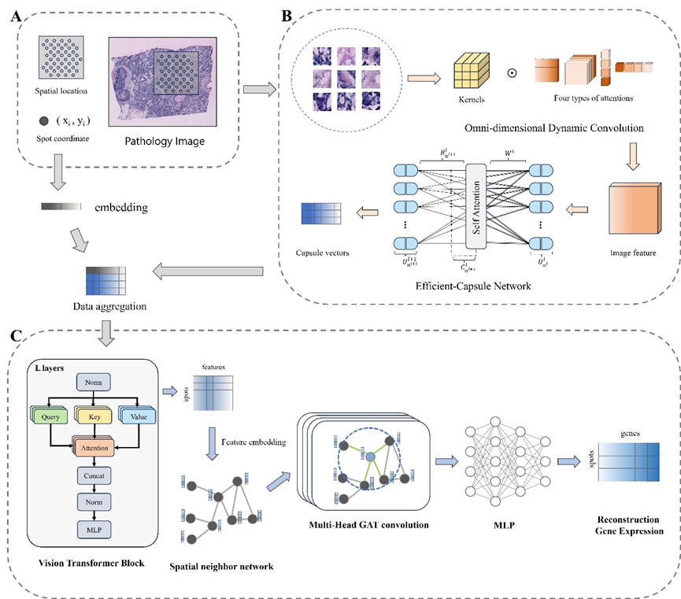

# THItoGene

THItoGene is a hybrid neural network that leverages dynamic convolution and capsule networks to adaptively perceive
latent molecular signals from histological images, for the systematic analysis of spatial gene expression within tissue
pathology. THItoGene integrates gene expression, spatial locations, and histological images to explore and analyze the
relationship between high-resolution pathological image phenotypes and tumor genetic morphology.  


## Environment

The required environment has been packaged in the [`requirements.txt`](./requirements.txt) file.    
Please run the following command to install.

```commandline
cd THItoGene
pip install -r requirements.txt
```

## Datasets

- Human HER2-positive breast tumor ST data https://github.com/almaan/her2st/.
- Human cutaneous squamous cell carcinoma 10x Visium data (GSE144240).
- You can also download all datasets from [here](https://www.synapse.org/#!Synapse:syn52503858/files/)

## Trained models

All Trained models of our method on HER2+ and cSCC datasets can be found
at [synapse](https://www.synapse.org/#!Synapse:syn52503858/files/).

## Usage

NOTE: Please download our `trained models` and `datasets` first and extract them to the corresponding folder.

```python
import torch
from torch.utils.data import DataLoader

from dataset import ViT_HER2ST
from predict import model_predict
from utils import *
from vis_model import THItoGene

test_sample_ID = 0
dataset = 'her2st'

# Model loading(Please unzip the trained model into the model folder first)
model = THItoGene.load_from_checkpoint(
    f"model/THItoGene_{dataset}_{test_sample_ID}.ckpt", n_genes=785,
    learning_rate=1e-5, route_dim=64, caps=20, heads=[16, 8],
    n_layers=4)
device = torch.device('cuda' if torch.cuda.is_available() else 'cpu')
# Data set loading
dataset = ViT_HER2ST(train=False, sr=False, fold=test_sample_ID)
test_loader = DataLoader(dataset, batch_size=1, num_workers=0)
# Model prediction
adata_pred, adata_truth = model_predict(model, test_loader, attention=False, device=device)
# Evaluation
R, p_val = get_R(adata_pred, adata_truth)
print('Mean Pearson Correlation:', np.nanmean(R))
print('-log10p_val:', -np.log10(p_val))
```

## Parameters

- `n_genes`: int.  
  Amount of genes.
- `learning_rate`: float between `[0, 1]`, default `1e-5`.  
  Learning rate.
- `route_dim`: int, default `64`.  
  Capsule network routing vector dimension.
- `heads`: int, default `[16, 8]`.  
  The number of heads of the Vit module and the number of heads of the GAT module.
- `n_layers`: int, default `4`.  
  Number of Transformer blocks.
- `caps`: int, default `20`.  
  Capsule network routing capsule number.

## Pipline

NOTE: Run the following command if you want to run the pipline

1. Please run the script [`download.sh`](./data/download.sh) in the folder [data](./data)
   (or run the command line `git clone https://github.com/almaan/her2st.git` in the
   dir [data](./data))

2. Run `gunzip *.gz` in the dir `./data/her2st/data/ST-cnts/` to unzip the gz files

### HisToGene training

```python
import pytorch_lightning as pl
from torch.utils.data import DataLoader

from dataset import ViT_HER2ST
from vis_model import THItoGene

fold = 0
tag = '-htg_her2st_785_32_cv'
dataset = ViT_HER2ST(train=True, fold=fold)
train_loader = DataLoader(dataset, batch_size=1, num_workers=0, shuffle=True)
model = THItoGene(n_genes=785, learning_rate=1e-5, route_dim=64, caps=20, heads=[16, 8], n_layers=4)
trainer = pl.Trainer(accelerator="gpu", devices=[0], max_epochs=200)
trainer.fit(model, train_loader)
trainer.save_checkpoint("model/last_train_" + tag + '_' + str(fold) + ".ckpt")
```

### THItoGene prediction

```python
import torch
from torch.utils.data import DataLoader

from dataset import ViT_HER2ST
from predict import model_predict
from utils import *
from vis_model import THItoGene

fold = 0
tag = '-htg_her2st_785_32_cv'
model = THItoGene.load_from_checkpoint("model/last_train_" + tag + '_' + str(fold) + ".ckpt", n_genes=785,
                                       learning_rate=1e-5, route_dim=64, caps=20, heads=[16, 8],
                                       n_layers=4)
device = torch.device('cuda' if torch.cuda.is_available() else 'cpu')
dataset = ViT_HER2ST(train=False, sr=False, fold=fold)
test_loader = DataLoader(dataset, batch_size=1, num_workers=4)
adata_pred, adata_truth = model_predict(model, test_loader, attention=False, device=device)
R, p_val = get_R(adata_pred, adata_truth)
print('Mean Pearson Correlation:', np.nanmean(R))
print('-log10p_val:', -np.log10(p_val))
```

## Citation
Jia et al. “THItoGene: a deep learning method for predicting spatial transcriptomics from histological images.” Briefings in bioinformatics vol. 25,1 (2024).[Paper](https://doi.org/10.1093/bib/bbad464).
