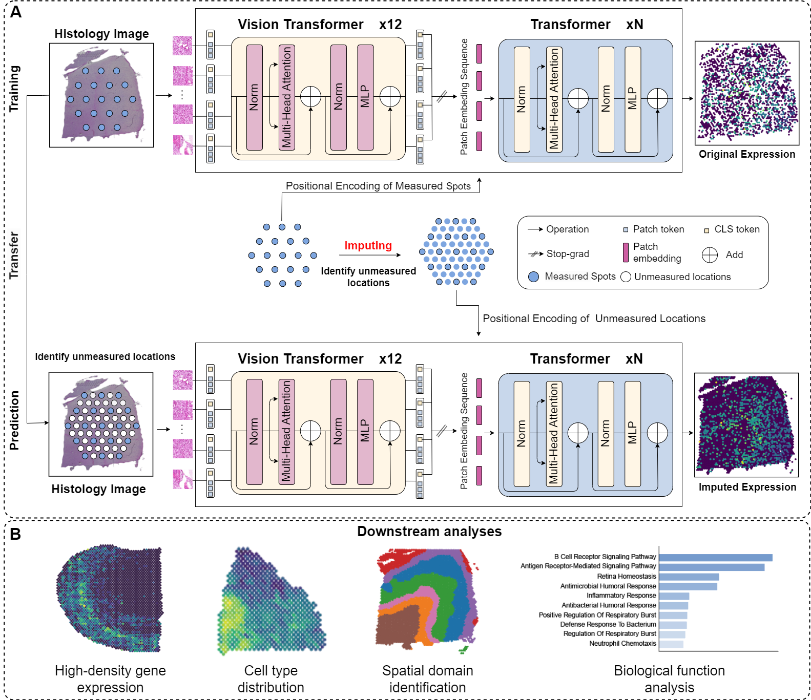

# Enhancing High-density Spatial Transcriptomics from Histology Images using HisHRST
Spatial transcriptomics (ST) is a technology that integrates spatial information with gene expression analysis to study
the spatial distribution of genes within tissues and their regulatory mechanisms. However, it is limited by the sparsity
of sequencing spots and the high cost of spatial transcriptomics technology, which hinders its widespread application in
biomedical research. An alternative and more cost-effective strategy is to leverage deep learning methods to infer high-
density gene expression profiles from histological images. To this end, we developed the HisHRST method based on an
offline pathological image foundation model, aiming to accurately generate high-density spatial transcriptomic data from
histological images. This method employs a multi-head attention mechanism to incorporate spatial location information,
thereby enhancing feature representation. We systematically evaluated HisHRST on six ST datasets and compared its
performance with five existing methods. Experimental results demonstrate that HisHRST can accurately predict gene
expression profiles for unmeasured spots, refine gene expression patterns, and effectively preserve the original spatial
structure of gene expression. Furthermore, this method facilitates the identification of biologically meaningful pathways,
thereby advancing the understanding of key biological processe.


## Overview of HRST



## Setup
```
pip install -r requirement.txt
```

## Data
All the datasets used in this paper can be downloaded from url：https://zenodo.org/records/12792074

## Getting access
In our multimodal feature mapping extractor, the ViT architecture utilizes a self-pretrained model called UNI. You need to request access to the model weights from the Huggingface model page at:[https://huggingface.co/mahmoodlab/UNI](https://huggingface.co/mahmoodlab/UNI). It is worth noting that you need to apply for access to UNI login and replace it in the [demo.ipynb](demo.ipynb).

## Running Experiments

This project supports training and evaluation on the DLPFC spatial transcriptomics dataset using PyTorch.

To train the neural network, use the following command:

```
python train.py
```
To evaluate the trained model on a test section:

```
python test.py
```

This script loads the model output (e.g., recovered_data.h5ad) and compares it with the original expression profile using metrics like:

Pearson Correlation Coefficient (PCC)  Mean Squared Error (MSE)  Mean Absolute Error (MAE)

## Contact details

If you have any questions, please contact zhicengshi@stu.ynu.edu.com and wenwen.min@qq.com
